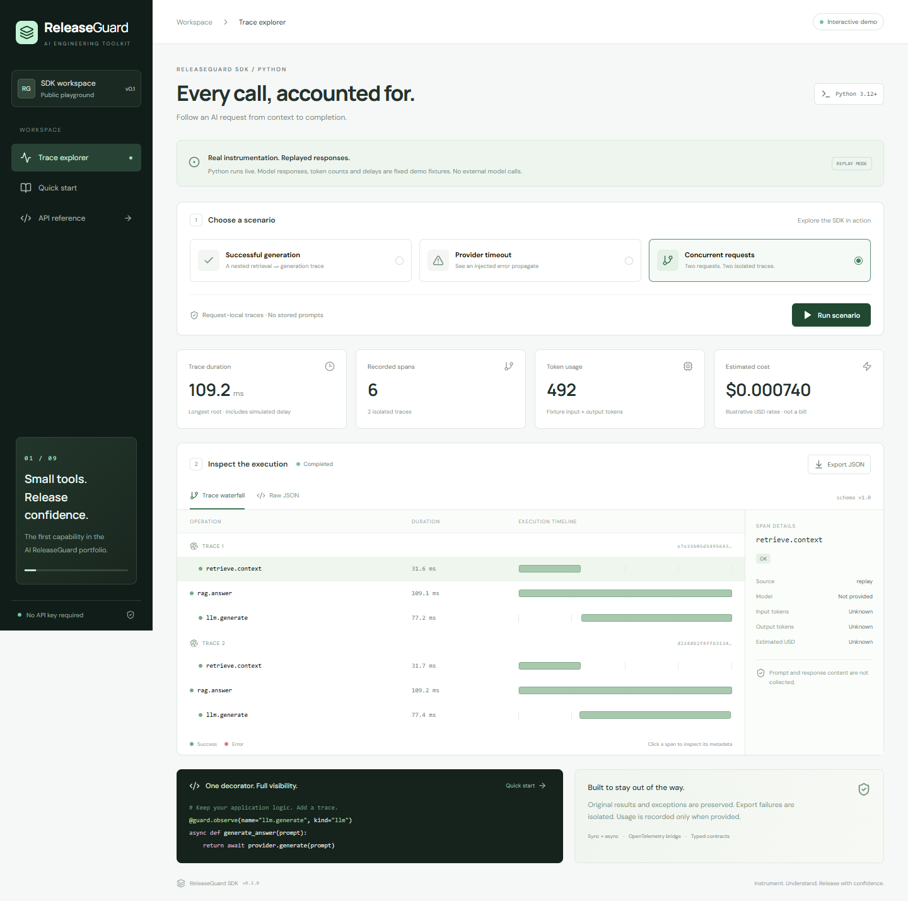

# ReleaseGuard SDK

**Every call, accounted for.** Lightweight Python instrumentation for LLM applications: nested traces, latency, token usage and estimated cost, with explicit privacy boundaries.

Capability **01 / 09** in the AI ReleaseGuard portfolio. This repository is independently installable and deployable; it does not require the other eight projects.

**Status:** v0.1.0 release candidate. See [publication status](docs/RELEASE.md) for the current GitHub release and Vercel deployment state.



## What this demonstrates

- Sync and async instrumentation that preserves the original result and exception.
- Context-local parent/child traces and isolated concurrent requests.
- Typed, versioned contracts; unknown usage/cost remains unknown.
- Bounded memory collection and an optional OpenTelemetry exporter bridge.
- Behavioral tests, an actual SDK overhead benchmark and a deployable trace explorer.

The demo runs real Python instrumentation over **fixed model responses, simulated delays and illustrative token/pricing metadata**. It never calls a paid model. Demo timings are not real model latency measurements.

## Run locally

Prerequisites: **Python 3.12+**, **Node.js 22+**, and **pnpm 11.19.0**. Enable pnpm through Corepack, or install it with `npm install --global pnpm@11.19.0` if Corepack is unavailable.

From this repository's root, in PowerShell:

```powershell
python -m venv .venv
.\.venv\Scripts\python.exe -m pip install -e ".[demo,dev,otel]"
pnpm install --frozen-lockfile
pnpm build
.\.venv\Scripts\python.exe -m uvicorn app:app --reload
```

Open **http://127.0.0.1:8000** for the trace explorer and **http://127.0.0.1:8000/docs** for the API reference. Using the virtual environment's Python directly avoids PowerShell activation-policy issues.

On macOS/Linux, use `.venv/bin/python` instead of `.\.venv\Scripts\python.exe`.

For frontend hot reload, run `pnpm dev` in a second terminal while FastAPI runs on port 8000. Open http://127.0.0.1:5173; Vite proxies `/api` to FastAPI.

### Terminal-only example

```powershell
.\.venv\Scripts\python.exe examples/basic.py
```

This prints two JSON spans sharing a trace ID: the child LLM call and its parent. The fixture provides token counts and caller-supplied illustrative rates; no network request is made.

## Use the SDK

Install only the SDK with `python -m pip install -e .`. FastAPI and React are not SDK runtime dependencies.

```python
import asyncio
from releaseguard_sdk import ReleaseGuard, Pricing, openai_usage

guard = ReleaseGuard()

@guard.observe(
    name="llm.generate",
    kind="llm",
    source="replay",
    model="fixture-small",
    usage_from=openai_usage,
    pricing=Pricing(input_per_million="1", output_per_million="3"),
)
async def generate():
    return {"usage": {"input_tokens": 100, "output_tokens": 20}}

async def main():
    with guard.collect() as traces:
        await generate()
    for span in traces.snapshot():
        print(span.model_dump_json(indent=2))

asyncio.run(main())
```

For other providers, supply a `usage_from(result)` function returning `Usage` or `None`, or call `guard.record_usage(model=..., usage=...)` inside an observed function. No provider package is imported automatically.

Do not label a real provider call as `replay`: omit `source` for live execution. Prices are supplied by the caller and may not reflect current provider billing. Unknown cost is `null`, not zero.

### OpenTelemetry bridge

```python
from opentelemetry.sdk.trace.export import ConsoleSpanExporter
from releaseguard_sdk import ReleaseGuard
from releaseguard_sdk.otel import OpenTelemetryExporter

guard = ReleaseGuard(OpenTelemetryExporter(ConsoleSpanExporter()))

@guard.observe
def work():
    return 42

work()
```

Install `.[otel]` first. The bridge preserves recorded IDs and parents but does not automatically join an external tracer or propagate HTTP headers. Export is synchronous; network exporters add latency. The application owns exporter flush/shutdown. `collect()` temporarily replaces the configured exporter with a local collector.

## Test

```powershell
.\.venv\Scripts\python.exe -m pytest -q
.\.venv\Scripts\python.exe -m ruff check .
pnpm build
.\.venv\Scripts\python.exe -m build
```

Tests cover nested sync calls, concurrent async requests, cancellation, exception identity, private-content omission, exporter failure, bounded buffers, usage normalization, invalid costs and the OpenTelemetry bridge. API tests exercise all scenarios, invalid input and simultaneous requests.

### Try the API directly

```powershell
Invoke-RestMethod http://127.0.0.1:8000/api/health
Invoke-RestMethod -Method Post -Uri http://127.0.0.1:8000/api/demo `
  -ContentType 'application/json' -Body '{"scenario":"success"}'
```

| Scenario | Expected result |
| --- | --- |
| `success` | One trace, three successful spans, 246 fixture tokens |
| `failure` | One trace, retrieval succeeds, generation and parent record an error; unknown usage/cost |
| `concurrent` | Two independent trace IDs, three spans each, 492 fixture tokens |

In the browser, inspect individual spans, switch to Raw JSON, download the report and open Quick start. A completed failure scenario is a successful demo execution of an injected failure, not a successful provider call.

## Benchmark

```powershell
.\.venv\Scripts\python.exe benchmarks/overhead.py --iterations 10000 --repeats 7
```

This writes [local benchmark data](benchmarks/results/local.json) with per-batch results, environment and median added microseconds. On the recorded Windows/Python 3.12 run, the medians were **9.94 μs sync** and **9.86 μs async** added per no-op call. It measures real SDK work with a bounded exporter; it does not measure an LLM or network call. See [methodology and limitations](benchmarks/README.md).

## Architecture and boundaries

```text
Observed Python function
  → Context-local span + monotonic timing
  → Optional explicit usage extraction
  → Immutable Span (schema v1.0)
  → Bounded memory collector / optional OTel exporter
```

Arguments, results and exception messages are not captured. Operation and model names are developer-controlled: keep them free of secrets. Parents do not sum child tokens or cost. A missing exporter causes no retention or network access. See [architecture](docs/ARCHITECTURE.md).

Streaming/generators, distributed propagation, persistent history, delivery retries and automatic provider interception are outside v0.1. Generator decorators fail explicitly instead of reporting misleading timings. Join spawned tasks before taking a final collection snapshot.

## Publish on GitHub and Vercel

This folder is the root of the standalone `releaseguard-sdk` repository. CI verifies tests and builds; version tags trigger GitHub releases with the wheel, source archive and benchmark.

Import the repository into Vercel using the **FastAPI** framework preset. The entrypoint is `app:app`; the configured build creates the React assets. No model key or database is required. Follow the [publication checklist](docs/RELEASE.md) and verify the public URL before advertising it.

License: [MIT](LICENSE).
