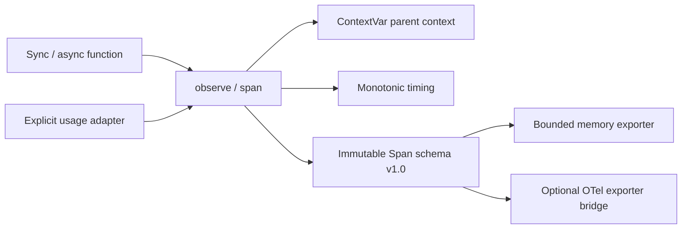

# Architecture

## Boundary

The SDK is a Python package with Pydantic as its only required dependency.
The FastAPI demo and React UI belong to this repository, but are not shipped
inside the SDK wheel. Other ReleaseGuard projects consume the wheel independently.

## Execution semantics

Each ReleaseGuard instance owns separate context variables. An observed call
creates a random trace ID at the root, or inherits its active parent's ID.
Async child tasks inherit context; unrelated request handlers do not.
A child beginning after its inherited parent has closed creates a new trace.
Join child tasks inside the collection scope when you need a complete snapshot.

The wrapper calls the original function exactly once. It returns the original
object and re-raises the original exception. Cancellation is captured and
re-raised. Monotonic nanosecond timing measures execution, while UTC timestamps
make records readable. Duration excludes exporter time; the overhead benchmark
includes exporter work.

Completed records are immutable. Token and cost fields apply to that span only:
parent spans do not accumulate child usage, avoiding double counting. Caller
supplied prices are USD per million input/output tokens; cached-token pricing
and provider billing reconciliation are outside v0.1.

## Failure boundaries

Exceptions raised by a usage extractor are captured by type in
instrumentation_errors. Ordinary exporter exceptions are logged by type, without
their potentially sensitive message, and cannot replace an application result.
Explicit misuse of record_usage raises at the call site; it is an application API,
not an implicit extractor. Configuration validation fails early.

Exporters are synchronous. The default SDK does not retain or send records.
collect() temporarily replaces the configured exporter with a bounded,
thread-safe buffer; oldest spans are evicted with a dropped counter.
A slow network exporter adds caller latency. v0.1 does not implement a delivery
queue, retries, or persistence.

## OpenTelemetry

The optional bridge converts completed Span records to ReadableSpan records and
preserves trace/span/parent IDs. It accepts an OpenTelemetry SpanExporter.
It does not install a global tracer provider, perform W3C header propagation,
or automatically join an existing external OTel trace. The caller owns exporter
flush/shutdown. OTLP needs the separately installed OTLP exporter package.

## Demo

POST /api/demo accepts only success, failure, or concurrent, and rejects extra
fields. Each request executes at most six spans with short simulated sleeps.
There are no provider calls, user prompts, file uploads, credentials, or persistent
history. Counters derive from that run. Unknown cost stays null.

Model responses, token counts and prices are invented fixtures, explicitly
labeled. Timings reflect actual Python execution including simulated sleeps,
not real provider latency.

The React build goes to frontend-dist, served by FastAPI locally. Vercel's
FastAPI deployment supports static file mounts. Benchmark jobs run in GitHub
Actions, outside serverless request lifetimes.

## Privacy and limits

Arguments, results, prompts and exception messages are not stored in Span.
Developers must keep operation/model names free of secrets. Exported IDs and
technical metadata can still be sensitive in a real application.

No streaming/generator wrappers, automatic provider interception, cross-process
propagation, sampling, durable storage, or distributed rate limiting in v0.1.
API hosting can incur Vercel usage even though the demo does not call paid models.

